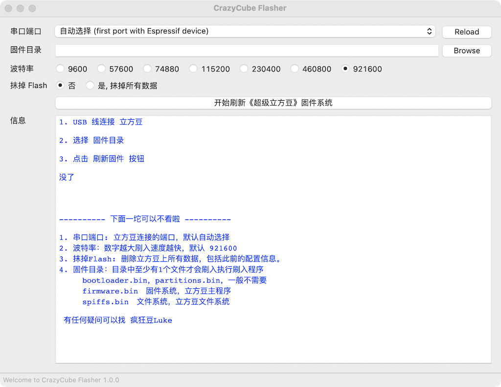

# CrazyCube Flasher (超级立方豆固件烧录程序)


Self-contained [CrazyCube Flasher](https://github.com/nodemcu/nodemcu-firmware) flasher with GUI based on [esptool.py](https://github.com/espressif/esptool) and [wxPython](https://www.wxpython.org/).




## About
CrazyCube Flasher is a specific application for upgrading the firmware of the CrazyCube system. It does not require installation - just double-click it and it'll launch. The application is available in both .exe file for Windows and .dmg file for macOS.


`CrazyCube Flasher` is a specialized application designed for upgrading the firmware of the CrazyCube system. The application does not require installation; simply double-click the file to launch it. CrazyCube Flasher is available in both .exe format for Windows and .dmg format for macOS.

This project is based on the [NodeMCU PyFlasher](https://github.com/marcelstoer/nodemcu-pyflasher). If you need to flash generic firmware, I recommend using the NodeMCU PyFlasher tool, which CrazyCube Flasher was built upon. The tool works well for ESP32 boards and may also work for other boards.


## 中文说明
1.  直接下载安装 dist 目.
	* Windows 系统下载 CrazyCube-Flasher.exe （win10以上）
	* Mac 系统下载 CrazyCube-Flasher.dmg
3. 升级固件
	* USB2.0 线连接电脑和超级立方豆。
	* 点击 Browser 按钮选择固件所在文件夹。
	* 点击 “开始刷新《超级立方豆》固件系统” 按钮开始升级
1.   自己编译 环境配置和  [NodeMCU PyFlasher](https://github.com/marcelstoer/nodemcu-pyflasher) 项目完全相同。 


## How to Upgrade Crazycube Fireware

1. CrazyCube Flasher
	* connect usb2.0 cable
	* select firmware folder
	* click Start button
	
2. Use Command
```
esptool.py --chip esp32 --baud 921600 --before default_reset --after hard_reset write_flash 0x10000 /xxxx/firmware.bin 0x8000 /xxxx/partitions.bin 0x1000 /xxxx/bootloader.bin 0x340000 /xxxx/spiffs.bin -fs detect
```

## License
[MIT](http://opensource.org/licenses/MIT) © 疯狂豆
